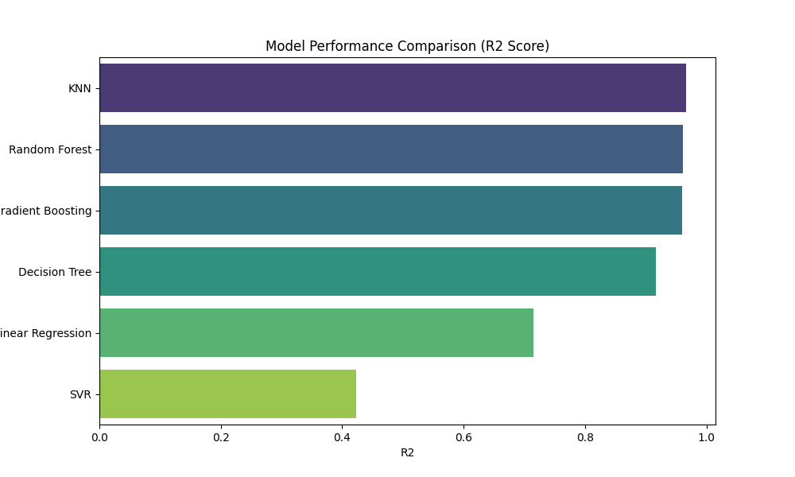
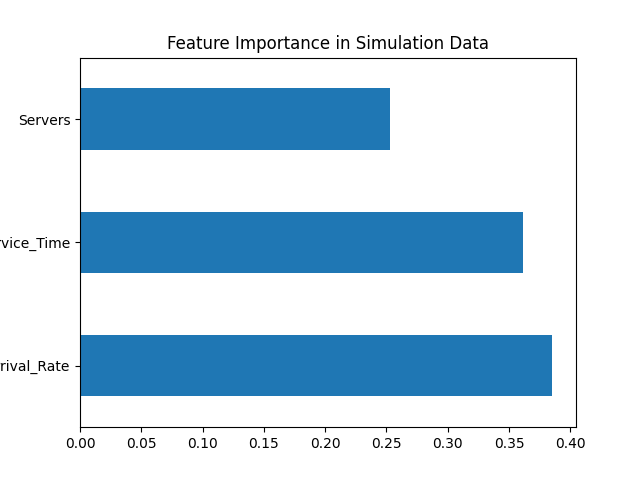

# Data Generation using Modelling and Simulation for Machine Learning

This repository is created as a submission for **Assignment-6 (UCS654)**.

**Submitted by:**  
Dhruv Sethi (102303785)

---

## 📌 Objective

The objective of this assignment is to generate synthetic data using a
modelling and simulation approach and evaluate multiple machine learning
models on the generated dataset.

---

## 🛠 Simulation Tool Used

**SimPy** – an open-source Python-based discrete-event simulation library.

SimPy was used to simulate a service system where entities arrive randomly
and are served by limited resources. The simulation generates realistic
performance metrics such as average waiting time.

---

## ⚙️ Simulation Parameters

For each simulation run, the following parameters were randomly varied:

- Arrival Rate  
- Service Time  
- Number of Servers  

**Target Variable:**  
Average Waiting Time

A total of **1000 simulation runs** were performed.

---

## 📊 Generated Dataset

The generated simulation dataset is stored in:

- `simulation_data.csv`

Each row corresponds to one simulation run with its input parameters and
the resulting average waiting time.

---

## 🤖 Machine Learning Models Used

The following regression models were trained and evaluated:

- Linear Regression  
- Decision Tree  
- Random Forest  
- Gradient Boosting  
- Support Vector Regression (SVR)  
- K-Nearest Neighbors (KNN)  

The comparison metrics were saved in:

- `results.csv`

---

## 📈 Model Performance Comparison

### R² Score Comparison

The following graph compares the R² scores of all models:

---

## 🔍 Feature Importance Analysis

Feature importance was extracted using the Random Forest model to
identify the most influential simulation parameters:

---

## 🧮 TOPSIS Analysis

TOPSIS was applied to rank models based on multiple criteria:

- RMSE (minimize)  
- R² Score (maximize)  
- Training Time (minimize)  
- Prediction Time (minimize)  

The TOPSIS results are available in:

- `topsis_result.csv`

---

## 🏆 Final Result

Based on TOPSIS analysis, **K-Nearest Neighbors (KNN)** achieved the highest
rank, indicating the best overall balance between accuracy and
computational efficiency for the simulated dataset.

---

## 📜 License

MIT License  
Copyright (c) 2026 Dhruv Sethi
